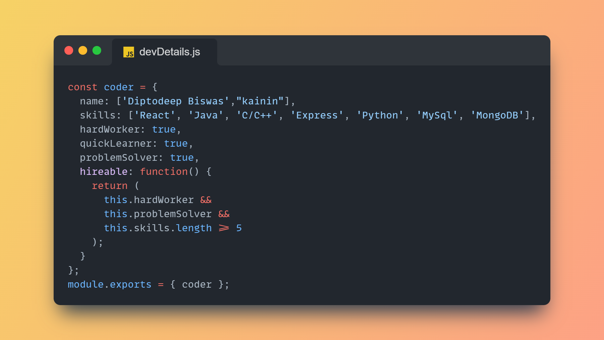
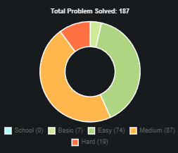

# Hi I am  Diptodeep Biswas(aka kainin)

# 💫 About Me

Hey there, I'm Diptodeep Biswas, a Developer on a journey to master programming for crafting exceptional Systems.

I'm a passionate developer who loves to learn new technologies and build cool stuff. I'm currently studying in Rcciit don't worry, by "iit" I mean institute of information and technology.

# ⚠️ Repository Information

I am new here so. I don't have much repository and many of them doesn't have readme so plz don't go harsh on me, as i "still learning". I promise i will make them better in near future.

# 🚀 Hackathon Highlights

I participated in Smart bengal hackthon twice

  **SMART BENGAL HACKATHON (RCC IIT, Kolkata)**
<ul>
<li>Team Name: <b>NovaByte</b>
     
    our team secured 2nd place on 17th april by building:- <b> a women safety app with mapping,tracking and sos activation using voice and gesture with police headquater , local police and ngo server chat support, safest path, audio video proof and many more.</b>
     
    <i><a href="https://drive.google.com/file/d/1TtiiuYWZiuPCtKHG8FTNPdYlsWCQEmBV/view?usp=sharing" target="_blank"> document proof</a></i>
     
     
<li>Team Name: <b>foxhackerz</b>
     
  Our team, foxhackerz, secured 5th place on 12th april in the hackathon by buidling :-
   
  <b>A secutiy app to lock and encrypt any data, it locks with mouse movement, facial data, norlam encryption, internet lock ,offline.
  </b>
   
  <i><a href="https://drive.google.com/file/d/1wP_lmml95-bcbeVyKrtZuZ2gy_yqPKKm/view?usp=sharing" target="_blank"> document proof</a></i>
     

</li>
</ul>

# 🌐 Socials

  

---

# 💻 Tech Stack

                    

---

# 📈 GitHub Stats

---

# GFG problem solving chart

