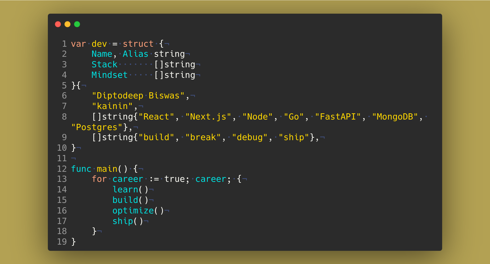

# Hi I am Diptodeep Biswas (aka kainin)

hey, i'm diptodeep — cs undergrad @ rcciit · full-stack dev · i build stuff — sometimes it works on the first try *(rare)*

i'm currently interning at **WhatBytes** slinging React Native, previously at **Capsule Labs** doing full-stack things with FastAPI + React. before that, **Bihar Innovation**, where i learned that REST APIs can always be more RESTful.

when i'm not coding: mentoring devs on CP, organizing hackathons, or deep in a rabbit hole learning Go.

---

## stuff i've built

**[Kai](https://github.com/dipto-kainin/kai)** — lightweight HTTP framework i wrote in Go from scratch. routing, middleware, path params, the works. yes, i wrote my own framework. no regrets.
`Go · net/http`

**[IronVine](https://github.com/dipto-kainin/ironvine)** — manga platform. Next.js frontend + NestJS backend + Prisma. built for scalable content delivery with auth and media workflows.
`TypeScript · NestJS · Prisma · PostgreSQL`

**[Terminal Tactician](https://github.com/dipto-kainin/Terminal-Tactician)** — Rag based card game with ai as the engine TUI based game with key input commands just put your own OSS groq key and play.
`Python · TUI · LangGraph · RAG · VectorDB`

**Women Safety App** *(Smart Bengal Hackathon — 🥈 2nd place, Team NovaByte)* — SOS via voice + gesture, live tracking, safest path routing, police/NGO chat integration, AV proof. shipped in 24h.

**Data Lock App** *(Smart Bengal Hackathon — 5th place, Team foxhackerz)* — encrypts data with mouse movement patterns, facial recognition, offline mode, internet lock. paranoia as a feature.

---

## the stack

**languages**

**frontend**

**backend**

**databases**

**tools**

---

## github stats

  

  

---

